# Education Toolkit User Guide

## About this guide

This document is an instructional manual for users of the DHIS2 for the capture of Education data. 

This manual aims to provide a practical guide to accessing and using the DHIS2 regarding education data. It outlines steps to access the system, change user and profile settings, data entry, and data quality management. 

Screenshots have been included in this document for clarity. Different styles of text have been used to highlight important parts of the document. Each of the conventions used are explained below:

## DHIS2 for Education demo server

The DHIS2 for Education demo server is set up to support awareness, development, testing, training, and ensuring quality of features and functions of the DHIS2-EMIS prior to country implementations.  Additionally, the demo is set up to host both data and metadata across various use cases to give users of the system a chance to explore and learn system features and functions.  The current demo server can be accessed at [https://emis.dhis2.org/demo](https://emis.dhis2.org/demo). 

> **Note**
> 
> Login credentials are available on the login page once you open the above URL. 

## Accessing the DHIS2-EMIS

This section provides guidance on the steps to access the EMIS. A user will need to have a computer, tablet, or Android phone connected to the internet with an internet browser. The most recommended browsers are Google Chrome or Mozilla Firefox.

### Log-in

To log into the DHIS2-EMIS

1. Launch Google Chrome or Firefox Web browser on your device.

   {width=100px }

2. In the address bar, type the web address https://emis.dhis2.org/demo and then press Enter
3. Wait for the page to load. If you see a page similar to the one below, you have successfully connected to the DHIS2-EMIS.
   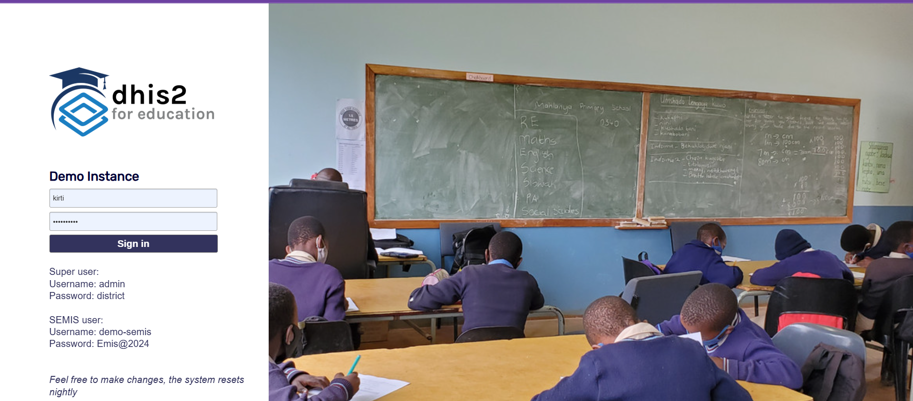

4. In the Username box, type your username

5. In the password box, type your password.

   > **Note**
   >
   > Names and passwords are case sensitive, ensure to place lowercase, uppercase and special characters where they should be in your password.

6.  Click Sign in or press Enter to log in.

### Logout

1. In case you need to log out of the system. Click on the abbreviation of your user account in the top right-hand corner, and select log out.

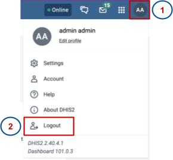

### Change user password

In order to maintain the security of the system and data, it is important to keep one’s account safe. One of the key security measures is to do a regular password change. In order to change password:

1. Click on the user initials in the top right hand corner.
2. Click on the account icon

   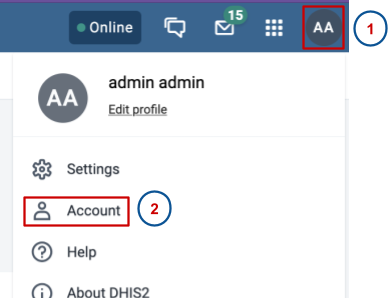

3. A page will appear, allowing you to edit your password. Type in your previous password once, then your new password twice as shown below:

   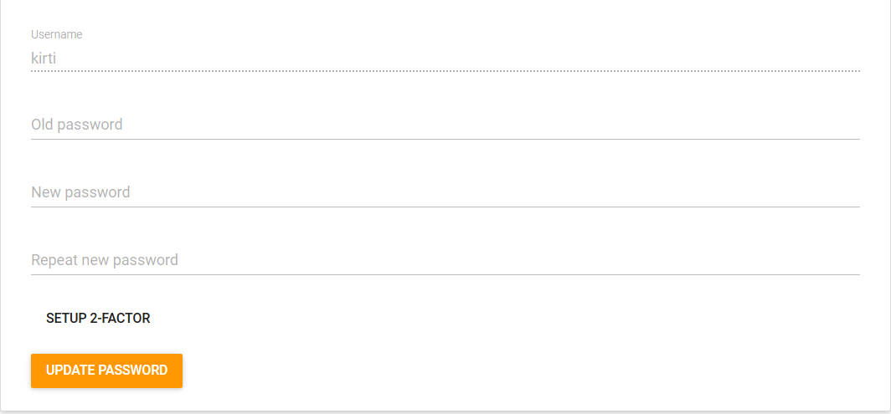{ width=600px }

4. Ensure that your password:
    * Has both lowercase and uppercase letters
    * Contains a special character
    * Is a minimum of 8 characters long

5. Click update password to save the new password

## DHIS2-EMIS Navigation

### Main applications

The DHIS2-EMIS has a number of applications - Apps that enable users to perform functions such as data entry, data analysis, and data presentation. All these applications are accessible through the applications menu / applications tray. This menu can be accessed by clicking on the nine dots in the top right-hand corner.

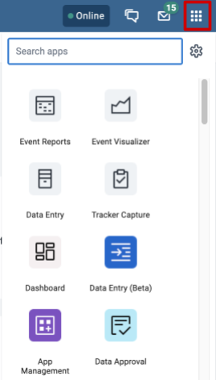

The main applications in the DHIS2-EMIS are highlighted below.

1. **Data Entry:** This application is mainly used for aggregate data capture for aggregated data values on a routine basis. These datasets have both data elements to capture the data values and indicators that provide for calculated values on the dataset forms. The form is designed to mimic the paper tools.
2. **SEMIS:** This application is used for individual data capture, such as learners, staff, and non-teaching staff, among others. It allows for the capture and update of data related to a specific individual. This data could include attendance, performance, transfers, socio-economics, and more. 
3. **Reports:** This application is used to preview aggregate data in a similar arrangement to how they are in the data entry app. The app is also used to monitor reporting rates at national, sub-national, and school levels.
4. **Data Visualizer:** This application is used for the presentation of data in a pictorial, graphical, and tabular format. With this, the users can see analytics visually, so as to identify new trends or patterns. The data can be downloaded from this application in various formats such as CSV, JSON, Excel, etc. This can be used for ad hoc analysis or to generate items that can be added to dashboards and reused as necessary.
5. **Maps:** This application is designed to store, manipulate, analyze, manage, and present all types of geographic data for visualization. For example, infrastructure availability can be visualized on a map showing the allocation of infrastructure at the school or sub-national levels. 
6. **Dashboard:** This is a user interface that organizes and presents charts, graphs, maps, and tables in a way that is easy to read and navigate for the user. It provides users with a view of their data at a glance. 

## Management of Aggregate Data

The Data Entry App is where users manually enter aggregated data in DHIS2-EMIS. In the data entry app, you enter aggregate data compiled for specific learning institution for the specified reporting period.

## Aggregate data entry

From the apps menu, click the data entry icon.

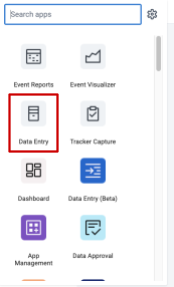

Once the data entry app is open, follow the steps below:

1. Select the learning institution where data will be captured by clicking the plus  icon on the hierarchy until you locate the school
    * Alternatively, you can use the search bar. Type the name of the institution, and a list will appear for you to select the institution.
  
    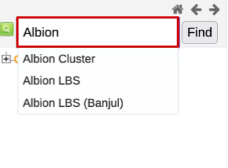
 
2. Click the name of the institution to enter data under it.

    > **Note**
    >
    > The search function returns all learning institutions with similar names or parts of the characters entered. In case there are institutions with similar names, double check in the hierarchy and ensure the institution selected is under the hierarchy of interest.

3. The selected institution will now be highlighted orange and displayed under the organisation unit in the data entry section.
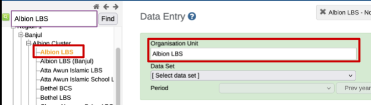

4. Select the appropriate dataset for data entry from the drop-down list provided. All the datasets for EMIS tool kit has a prefix as shown in the below picture
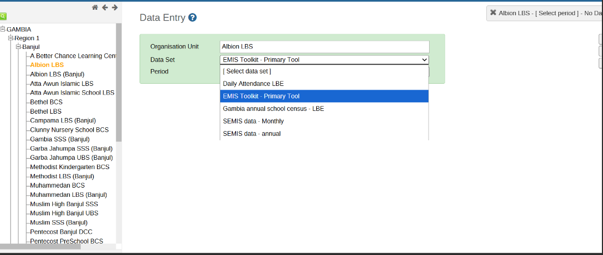

5.  Select the period for which data is being captured from the drop-down. Period could be annual, quarterly, monthly, weekly depending on the dataset settings.
    Make use of Prev year/ Next year to navigate from one year to another. 
    
     

    > **Note**
    >
    > The datasets are listed based on the access rights of the user as well as the institutions attached to that particular dataset. 

6. Once the data entry form is displayed, click on the section tab to the left of the data entry form to display the data entry fields and enter data for that particular section.
   
    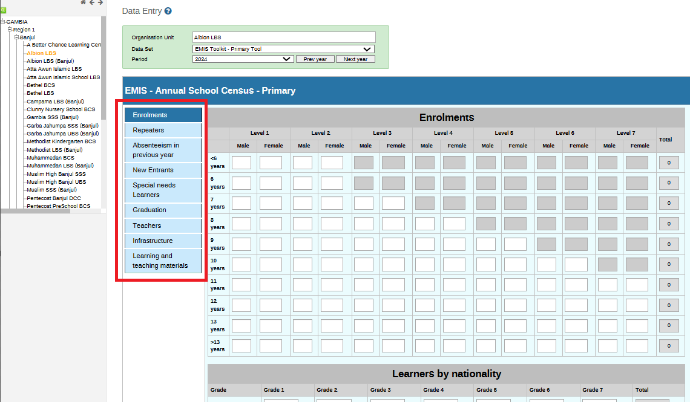

    > **Tip**
    >
    > Use the forward and backward arrows above the organisation unit hierarchy to collapse or expand the organisation unit panel.

7. During data entry, the fields turn from yellow to green, implying that the data has been automatically saved. If the field remains red after entry, it means there is an error. A grey field means that the field is disabled and data cannot be entered in it.
   
8. To navigate between fields:
   
    1. Move to the next field by pressing the Tab key or the Down Arrow key. 
    2. Move back to the previous field by pressing Shift + Tab or the Up Arrow key.
   
9.  If you type an invalid value, for example a letter in a field which only accepts numeric values, you’ll be presented with a pop-up that explains the problem and the field will be colored red (not saved) until the error is corrected. 
    
    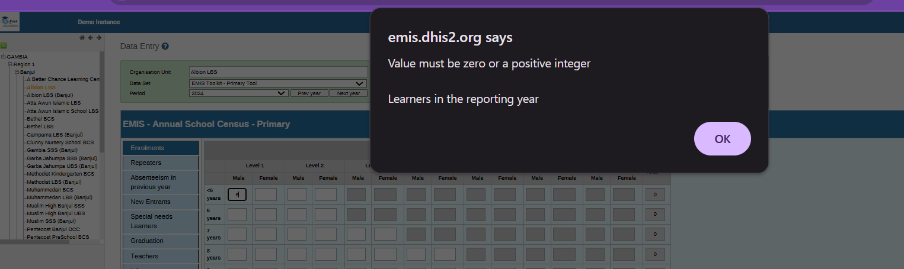

10.  After data entry, Run validation. If passed, click Complete to commit that all the data has been entered.
    
    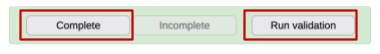

11.   If any validation violations are flagged, the data entrant should correct otherwise, this will remain tracked in the system.

    > **Note**
    >
    > The datasets are listed based on the access rights of the user as well as the institutions attached to that particular dataset.

## Enter data offline

The Data Entry application works even with unstable internet connectivity. In case internet connection is disrupted during data entry, the data entered is saved in the browser (as long as your page remains open). Once the internet connection is restored, the application will push the data to the server.

> **Note**
>
> To use this functionality, you must have logged onto the server while the internet connection is stable.

* When connected to the internet, the application displays this message at the top of the data entry screen.

    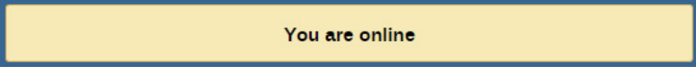{ width=600px }

* If internet connectivity is disrupted during data entry, the application detects it and displays the message below

    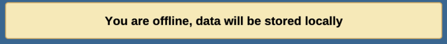{ width=600px }

    Now your data will be stored locally. You can continue to enter data.

* Once you have entered all the necessary data and the application detects that the internet connection is back, you will see the message below:

    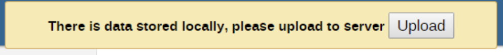{ width=600px }

* When the data has been successfully saved to the system, you will now receive the confirmation message below:

    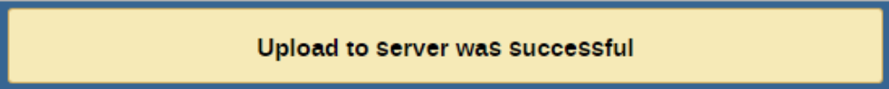{ width=600px }

### Edit data values in a completed data entry form

1. Within the data entry app, open the existing dataset / form which would like to make edits to
2. Click incomplete
3. Edit the relevant data values accordingly
4. Click complete

### Display a data value’s history

This displays the last 12 values registered for a field for the period of the reporting tool

1. From the data entry application, open an existing data entry form
2. In the dataset, double-click the field with the value you would like to view the history for
3. Click on the Data Element History tab
   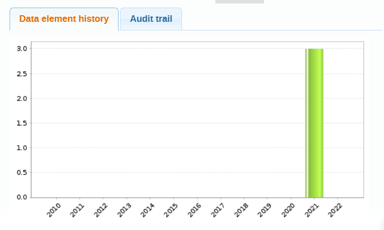

4. Click on Audit Trail tab to view the field’s audit trail. The audit trail allows you to view other data values which have been entered prior to the current value. The audit trail also shows when the data value was altered and which user made changes.
   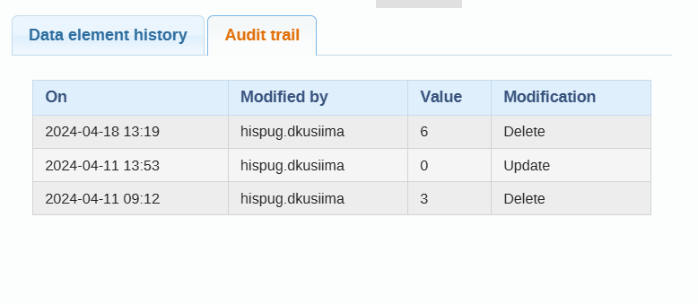

## Data Quality

### Validation Rule Analysis

Validation rule analysis allows perusal through the entire system and highlights all the validation rules that are not being adhered to. Additionally, it shows the data dimension violated and all details about it. Validation rule analysis can be automated in Data Administration to run periodically or manually in the Data Quality app.

To run manual Data Validation analysis

1. Click on apps and select data quality app.
 
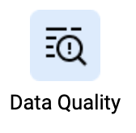

2. Click run validation under validation rule analysis

    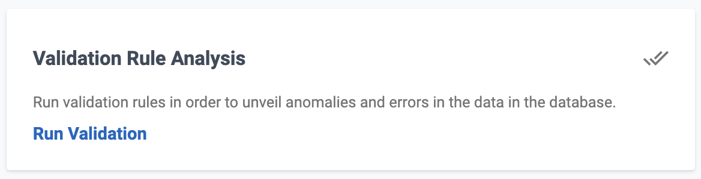{ width=600px }

3. Select the organization unit and date between which validation is to be done. Select whether all validation rules should be checked or only those for specified places level and period.
   
4. Click on validate.
   
    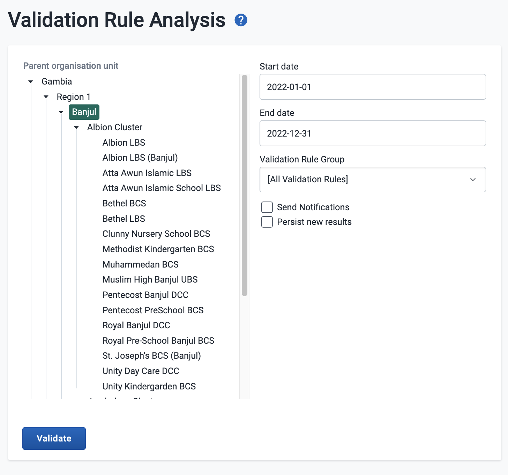{ width=600px }

5. The output will either be a line list of the violated rules or a “Validation Passed Successfully” notification.
   
    { width=600px }

    { width=400px }

6. On the line list of violated validation rules, you can click on the details icon to see full details of the violated rule.
7. The line list shows the organization unit and period which can be used to access the exact dataset and fix it as necessary.