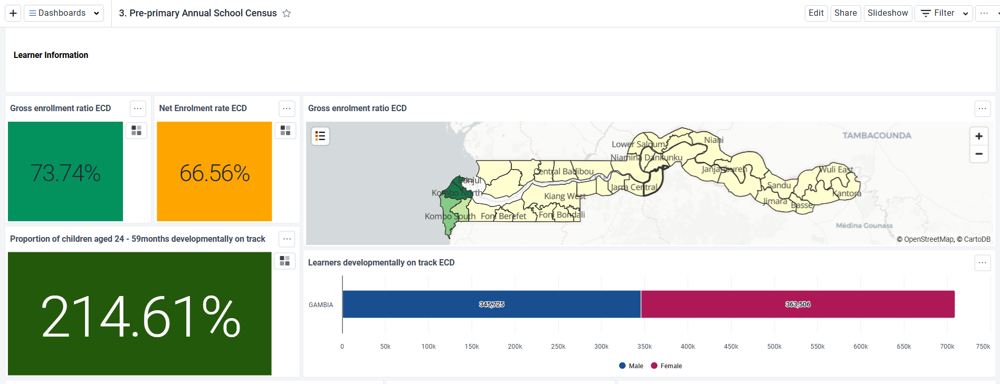
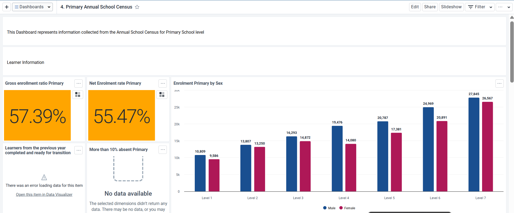
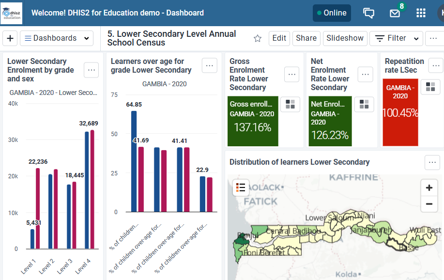
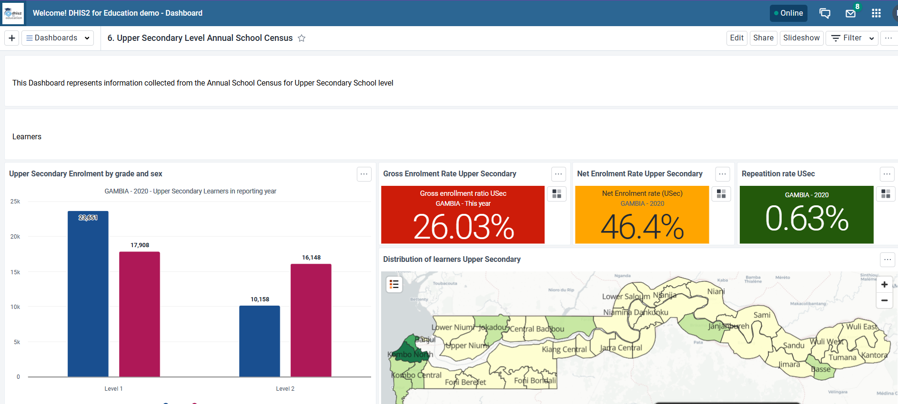
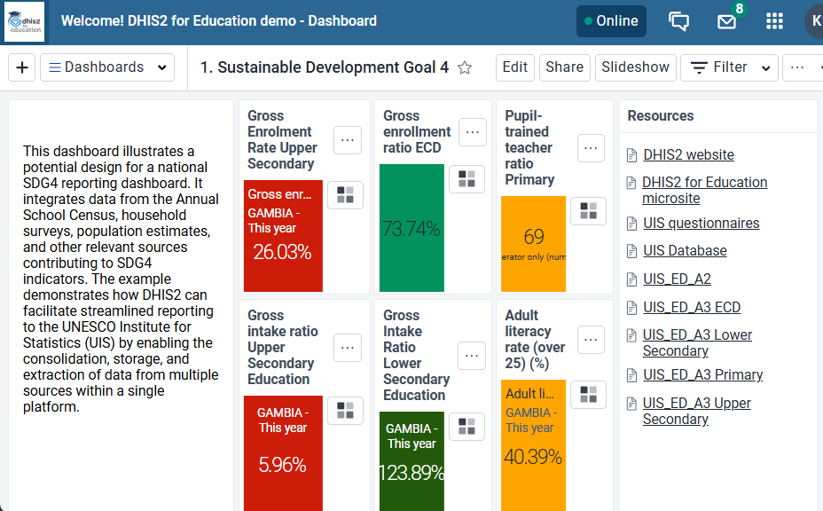
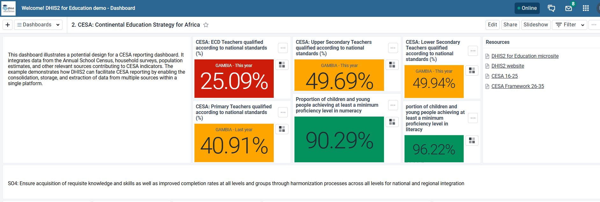
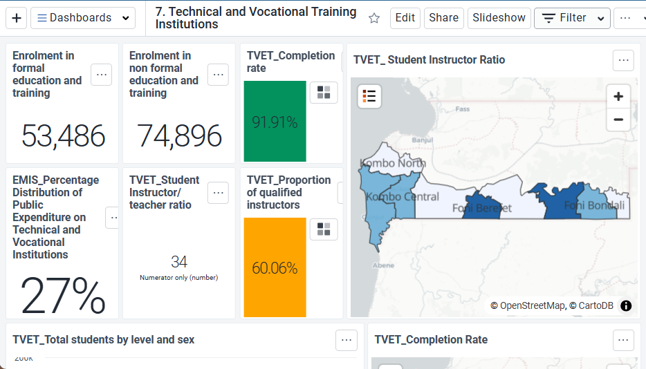

# Education Toolkit Design Documentation

## Overview

The Education toolkit collects both routine and survey education data that can be captured at national, district and school level. 

* At **school level**; the toolkit collects routine information similar to the annual school census forms such as enrolment numbers, new entrants, repeaters, attendance and more.  
* At **district level** the toolkit collects; 
  
    1. Population data broken down by age group and sex; this feeds into indicators such as gross and net enrolment ratios,
    2. Survey data that focusing on proficiency, educational attainment, ICT skills and more. 

These data can be widely useful for planning resource allocation, identifying bottlenecks in service delivery and education budget allocation.

## Objective

Having a standard education toolkit is expected to support countries in standardizing their data collection and information use. The toolkit is aimed at pointing countries to the bare minimum data needed to be collected in order to be able to monitor -  Sustainable Development Goal 4 (SDG 4) and The African Union's Continental Education Strategy for Africa (CESA). This in turn will bring countries closer toward the goal of inclusive and equitable education and promoting lifelong opportunities for all.

## Content and alignment with other tools

The education toolkit contains 8 datasets data variables about the schools and communities. 

These datasets include:

Annual School Census for the different school levels:

* ECD
* Primary
* Lower Secondary
* Upper Secondary
* Tertiary institutions

District-level datasets:

* Population
* Surveys

National level dataset:

* National expenditure

Many elements of the tools are aligned to a subset of questions from SDG4 and CESA indicators. 

## System Design

The design builds on previous experience from countries using education data.

### Intended users

* District education teams: may capture data for facilities that don’t have connectivity; analyze and use data for planning and preparedness

* School administrators who may capture, analyze and use data where infrastructure is available

* National programmes, Ministries of Education and Department of Planning.

### User groups

| User Group         | Dashboard       | Program Metadata   | Program Data        |
|--------------------|-----------------|---------------------|----------------------|
| **EMIS-Admin**   | Can edit and view | Can edit and view   | No access            |
| **EMIS-Access**  | Can edit and view | Can view only       | Can view only        |
| **EMIS-Data capture** | No access       | Can view only       | Can capture and view |

### System structure

* Uses the **aggregate model** of DHIS2  
* Datasets are reported from respective administrative levels:

    1. Annual School Census for the different school levels:
        * ECD
        * Primary  
        * Lower Secondary  
        * Upper Secondary  
        * Tertiary institutions  

    2. District-level datasets:
        * Population  
        * Surveys  

    3. National-level dataset:
        * National expenditure  

* Datasets are **sectioned** to ease the process of data entry  
* **Custom forms** are used based on the level of disaggregation of education data.
* There are 8 datasets in total
* Dataset sections are used to group sets of questions related to a thematic area, such as enrolment or staff 
  
    * School level data capture
    * District level data capture
    * National level data capture

## Analytics

The toolkit's analytical features have been developed to align with both standard education planning requirements and the reporting needs of SDG4 and CESA

A total of 7 dashboards are available:

### Pre-primary school census 

The dashboard presents visualizations derived from routine data collected from Early Childhood Development Centers (ECDs). This dashboard serves as a tool for monitoring pre-primary school enrollment figures, the presence of special needs learners, and the status of infrastructure in pre-primary schools.

### Primary annual school census dashboard

This dashboard features visual representations of data routinely gathered from primary schools. It serves as a valuable tool for monitoring and planning for primary schools, taking into account aspects such as enrollment requirements, special needs students, attendance, infrastructure, and other relevant factors.

### Lower Secondary School and Annual School Census Dashboard

This dashboard provides visual representations of data collected routinely from lower secondary schools. It is a valuable resource for monitoring and planning with regard to lower secondary schools, taking into consideration enrollment requirements, students with special needs, attendance, infrastructure, and other relevant factors.

### Upper Secondary School and Annual School Census Dashboard

This dashboard showcases visualizations derived from the regular data collected from upper secondary schools. It serves as a valuable tool for monitoring and planning for upper secondary schools, addressing aspects such as enrollment requirements, special needs students, attendance, infrastructure, and other pertinent factors.

### Sustainable Development Goal 4 (SDG 4) dashboard

Countries can employ this dashboard to track their advancement in achieving the SDG4 objective of ensuring inclusive and equitable access to education and promoting lifelong opportunities for all. The dashboard encompasses progress related to completion rates, gross enrolment ratios, gross intake ratios, out-of-school rates, pupil-teacher ratios, and other relevant metrics.

### The African Union's Continental Education Strategy for Africa (CESA) dashboard

Countries can utilize this dashboard to track their advancement with respect to the African Union's CESA framework, which was established to oversee the evolution of education systems in the African region

### Technical and Vocational Training Institutions Dashboard

This dashboard presents key education statistics for Technical and Vocational Education and Training (TVET) institutions. It provides an overview of student enrolment, completion, staffing, and expenditure, helping policymakers and managers track progress and identify gaps.

Overall, the dashboard provides a snapshot of access, quality, and resource allocation in TVET, supporting evidence-based decision-making for education and skills development.

