# SEMIS – Configuration Manual

# Introduction

The **SEMIS application** provides functionality for managing student and staff information within DHIS2 using **tracker-based programs**. In addition to operational data entry, the application includes built-in configuration options that allow administrators to manage system settings and metadata.

Unlike systems that use a separate configuration application, SEMIS integrates configuration directly within the **SEMIS App interface**. Administrators can access configuration features by selecting the **Configuration option** within the SEMIS application.

This integrated design ensures that system administrators can configure the system while remaining within the same application environment used for operational workflows.

The SEMIS configuration interface allows administrators to:

* Activate or deactivate functional modules  
* Configure program stages and metadata  
* Map option sets and data elements  
* Manage system settings related to the Academic year and School Calender

# User Roles and Access Requirements. 

Access to the SEMIS APP Configuration  tab is typically restricted to users with **administrative privileges**.

| User Roles | Responsibility |
| :---- | :---- |
| System Administrator | Configure metadata, programs, and module activation |
| Implementation Specialist | Configure tracker workflows and data structures |

Users must have the following permissions in DHIS2:

* Access to the **SEMIS application**  
* Permission to configure **Tracker Programs**  
* Access to **Maintenance App** metadata configuration

# How to Access SEMIS Configuration 

To configure SEMIS settings, administrators must access the configuration section within the SEMIS application.

NOTE: Use the SEMIS Configuration App after configuring the student and staff tracker programs in DHIS2.

## **Steps to Access Configuration**

1. Log into **DHIS2** using administrator credentials.  
2. Open the **App Menu** from the DHIS2 navigation bar.  
3. Select the **SEMIS App**.

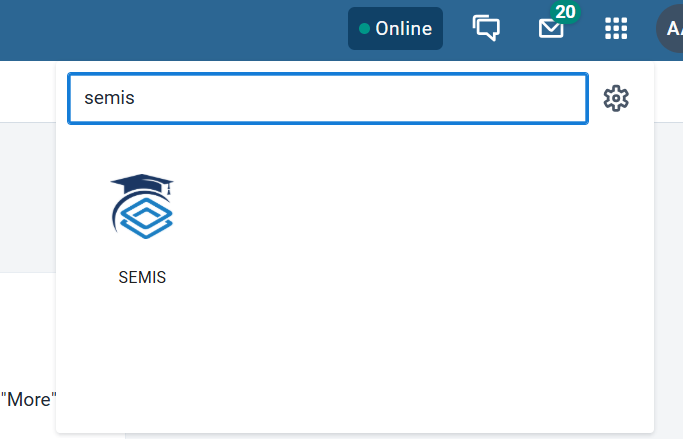

4. Within the SEMIS interface, on the right side panel you have the  **Configuration** option.  
5. Under Configuration you have two options:  
* School Calendar  
* Configurations

The configuration interface displays all available modules grouped under:

* **Student Modules**  
* **Staff Modules**

Each module can be activated and configured according to system requirements.

## **Recommended Steps for Configuration:**

1. Configure school calender  
2. Configure student module screens  
3. Configure staff module screens  
4. Validate the workflows such as Enrolment,Attendance,Final Result,Transfer Flows.

# Module Activation

The SEMIS configuration interface includes toggle switches that allow administrators to enable or disable specific modules.

Toggle status: 

| Status | Meaning |
| :---- | :---- |
| Green  | Module is active and available for use |
| Grey 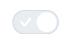| Module is inactive and hidden from operational workflows |

Administrators should activate only the modules required for the current **education system implementation**

**For example:**

* If student attendance is tracked digitally, the Student Attendance module should be activated.  
* If socio-economic information is not collected, the Socio-economic module may remain inactive.

Activating a module enables:

* Data entry interfaces  
* Program stage workflow.  
* Associated analytics and reporting features

# School Calendar Configuration

The **School Calendar** allows administrators to define the structure of the academic year within SEMIS. It includes the configuration of academic years, school terms, school days, and non-school days.  
Proper configuration ensures that modules such as **attendance tracking, academic reporting, and analytics** operate correctly based on the defined academic timeline.

The School Calendar helps the system:

* Establish the **academic year context**  
* Determine **valid attendance days**  
* Control **default filters and reporting periods**  
* Maintain consistent **school operational schedules**

## **Accessing the School Calendar** 

Steps

1. Open the **SEMIS App** in DHIS2.  
2. Navigate to the **School Calendar section** within the configuration area.  
3. The page displays a list of **existing academic years**.

The interface typically shows:

* Academic Year Name  
* Academic Year Code  
* Start and End Date  
* Actions (View Details, Edit, Delete)

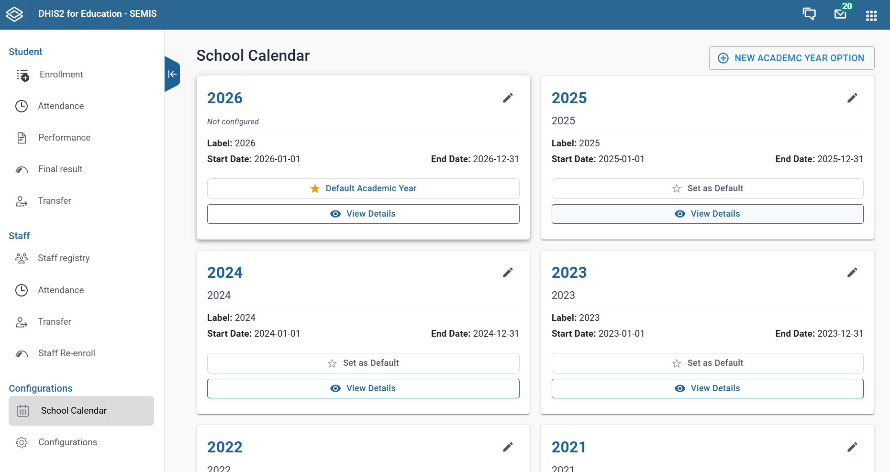

## **Creating a New Academic Year**

Administrators must create a new academic year before schools begin recording attendance or academic data.

Steps

1. Click **New Academic Year Option**.  
2. A form will appear to enter academic year details. i.e. Name and Code
3. Click Save
4. After this Click on the **Pen icon** as seen in the box.
5. Enter the following information.

| Field  | Description |
| :---- | :---- |
| Name | Full name of the Academic Year ( e.g., Academic Year 2026 \- 2027\) |
| Code | Short system code (e.g., AY2026) |
| Start Date | Official start date of the academic year |
| End Date | Official end date of the academic year |

6. Once saved, the academic year will appear in the academic year list.

   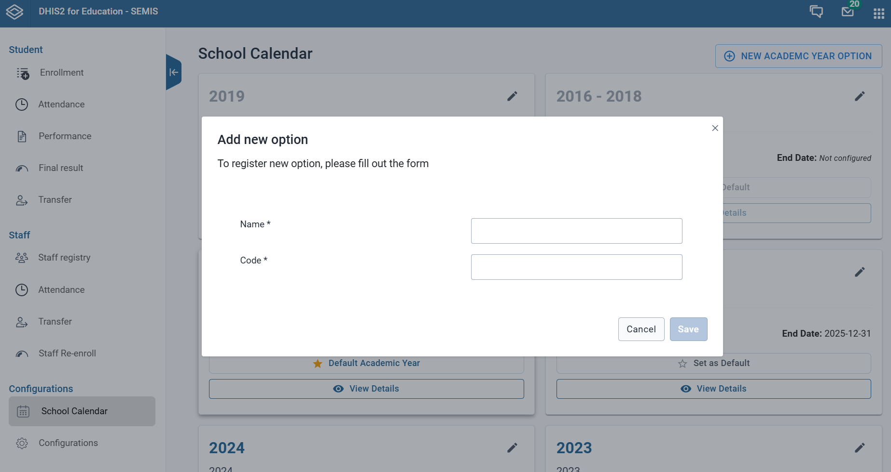
   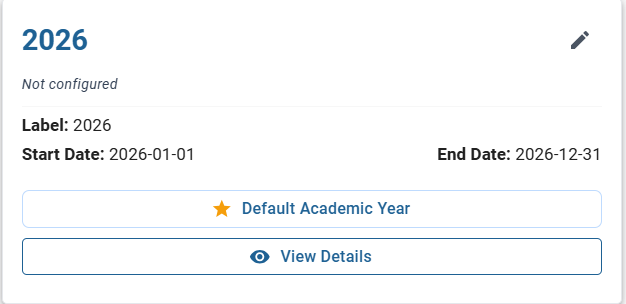
   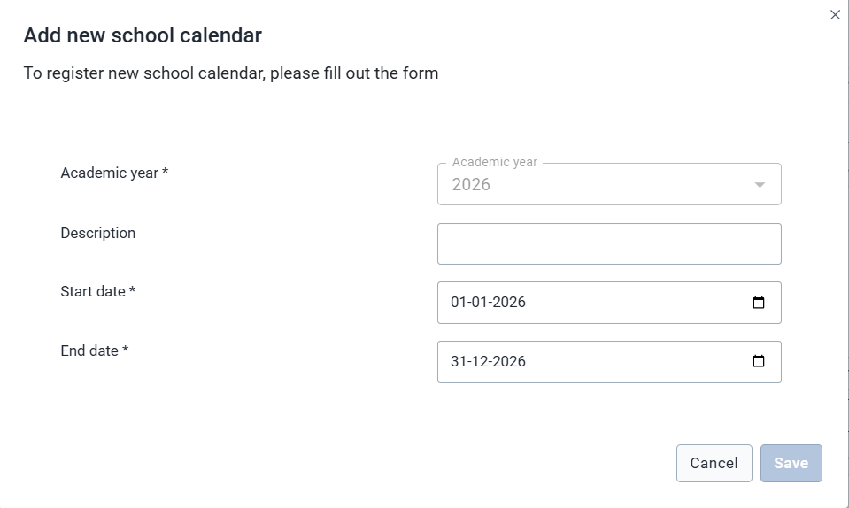
   

## **Viewing and Configuring Academic Year Details** 

You need to configure 
1. General Details
2. School Terms
3. Non - School Days

### **Configuring School Days under General Details** 

After creating an academic year, administrators must configure the academic structure

1. Locate the Academic year from the list  
2. Click View Details

The system opens the **Academic Year Configuration page**, where additional elements can be configured and also school days can be configured under General Details.

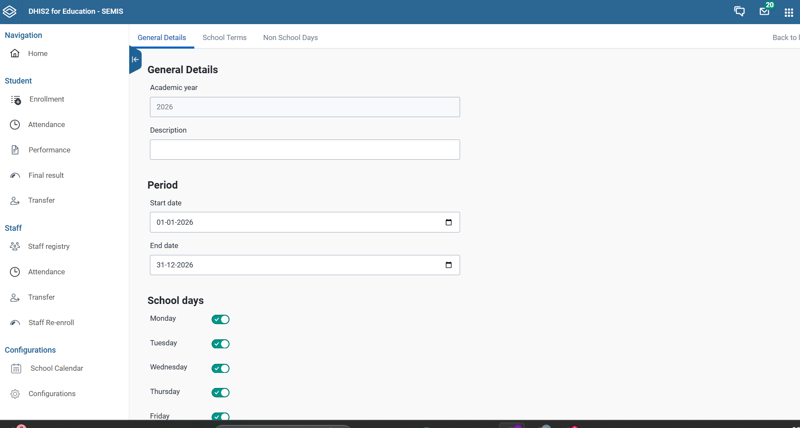

Administrators can define **regular school operational days**.

Typically this includes:

* Monday  
* Tuesday  
* Wednesday  
* Thursday  
* Friday

If a school operates on weekends, these days can also be enabled.

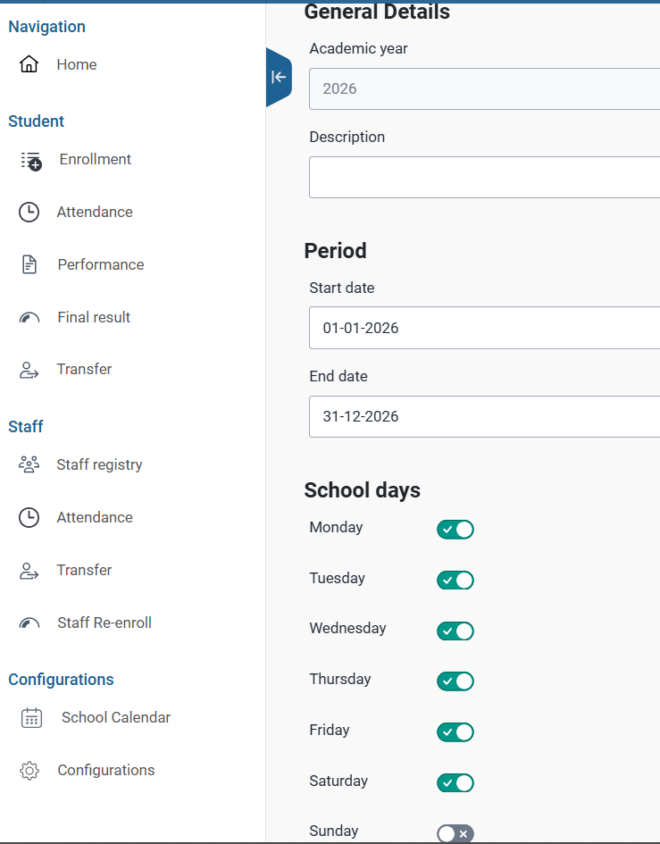

### **Configuring School Terms**

School terms divide the academic year into defined teaching periods.

Steps

1. Within the academic year details page, locate the **Terms section**.  
2. Click **Add Term**.  
3. Enter the following information:

| Field  | Description |
| :---- | :---- |
| Term Name | Name of the term (e.g., Term 1, Term 2\) |
| Start Date | Start date of the term |
| End Date | End date of the term |

4. Save

**Important Rules**

* Terms must **fall within the academic year dates**.  
* Terms **must not overlap**.  
* Each academic year should contain **all required terms**.

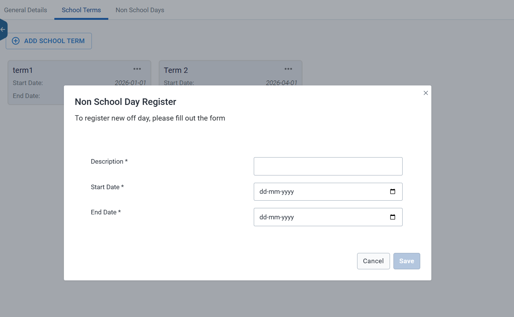

### **Configuring Non-School Days**

Non-school days include **holidays, public holidays, and school closures**.

### **Steps** {#steps}

1. In the **Academic Year Details page**, go to **Non-School Days**.  
2. Click **Add Non-School Day**.  
3. Enter the required details:

| Field | Description |
| :---- | :---- |
| Date | Mention the Date |
| Type | Reason for closure (Special event / Public Holiday) |
| Event | Name the event |

4. Click Save.

These dates will automatically be excluded from attendance calculations.

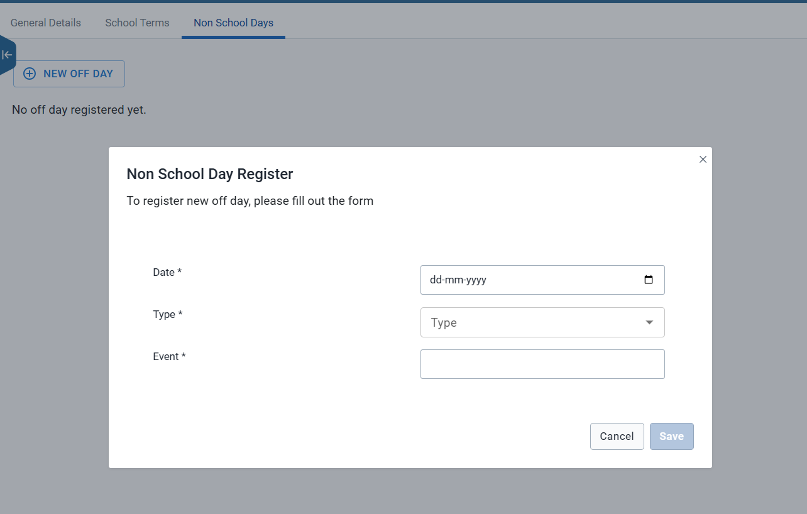

# Validation Checklist Before Using the Calendar 

Before the school calendar is used by schools, administrators should verify the following:

1. Academic Year Exists \- Ensure the **current academic year is created and active**.  
2. Terms Are Correct.

   Confirm that:

* Terms do not overlap  
* Terms fall within the academic year

3. Holidays Are Configured \- Verify that public holidays and school closures are correctly defined  
4. Operational Days Are Accurate \- Ensure the configured school days reflect **actual school schedules**.  
5. Calendar Visibility \- Ensure that the academic year is **accessible to the intended schools and users**.

# Student Configuration Overview

The **Student Configuration** section in the SEMIS application allows administrators to control how student-related modules function in the system. Through this configuration interface, administrators can enable or disable specific modules that support student management workflows.

This configuration helps ensure that only the required modules are available to schools based on their operational needs.

## **Accessing Student Configuration** 

To access the Student Configuration settings:

1. Open the **SEMIS application** in DHIS2.  
2. Navigate to **Configurations**.  
3. Select **Student**.

This page displays a set of module icons representing different student-related processes that can be configured.

The primary goal of this section is to **define and control the behavior of student workflows** within the SEMIS system.

Administrators can use this configuration to:

* Enable or disable specific student management modules.  
* Control which features are visible to users.  
* Customize the system based on institutional requirements.

This helps streamline workflows and prevent users from accessing modules that are not required.

## **Student Modules**

The Student Configuration interface includes several modules that support the student lifecycle.

### **Enrollment**

This module manages **student admission and enrollment into schools**. It allows users to register students and record their admission details and also socio-economic details.

1. Specify Registration Details e.g Grade, Grade filter name, Registration program stage (DHIS2 tracker configured) etc. and Socio Economic details  
2. Specify default configurations and submit.  
3. Fill in all mandatory fields, marked with \*

   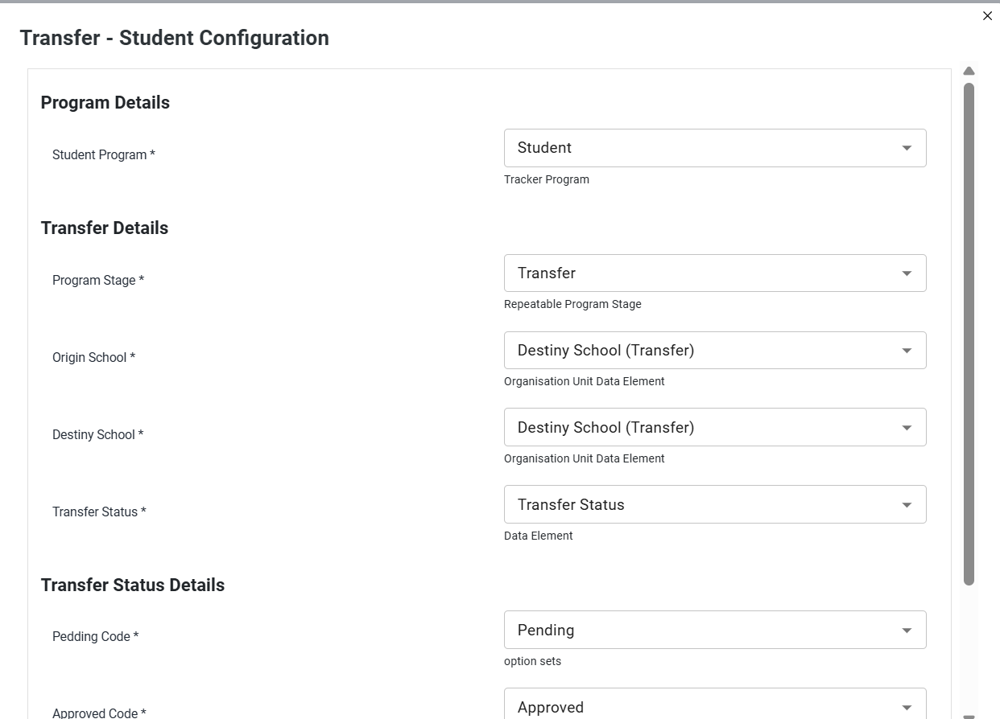

### **Attendance**

The Attendance module enables schools to **record and manage student attendance**. Attendance tracking uses the configured school calendar and academic year.

1. Select and confirm DHIS2 tracker configured student program.  
2. Configure attendance status details and general details e.g. program stage, attendance status (Present, Absent)  
3. Configure class attendance (Optional)
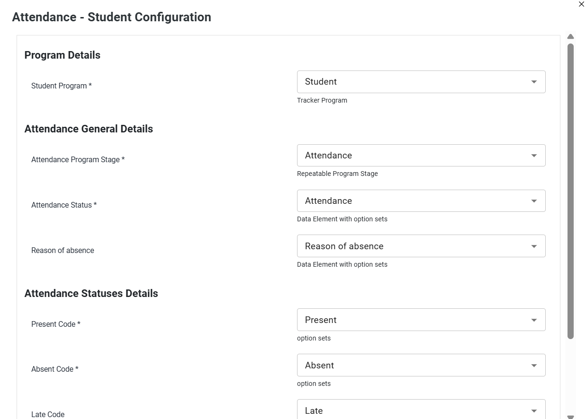

### **Performance**

The Performance module is used to **capture and manage student academic performance**, such as grades, assessments, and evaluation results.

1. Select and confirm DHIS2 tracker configured student program  
2. Select Performance program stages (DHIS2 Tracker configured)

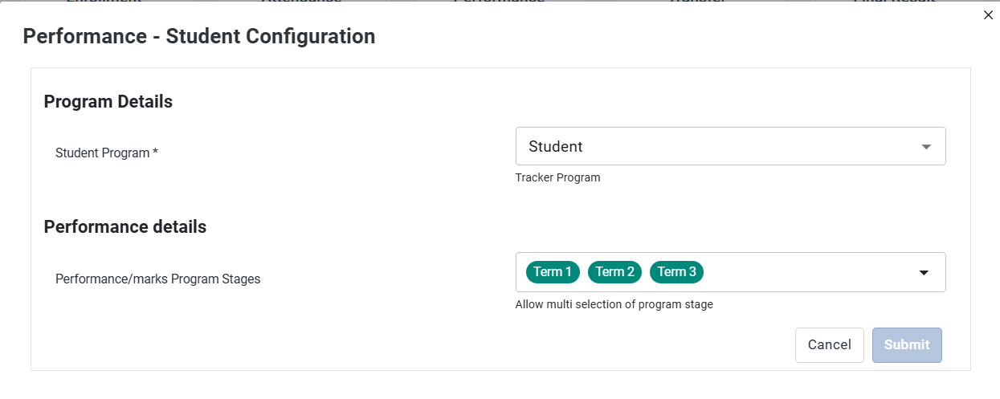

### **Transfer**

This module allows administrators to **manage student transfers between schools** within the system.

1. Select and confirm DHIS2 tracker configured student program.   
2. Confirm transfer request fields/status mapping   
3. Confirm incoming/outgoing list behavior tied to configured status  
4. Confirm approval/rejection flow field.

### **Final Result**

The Final Result module manages **student promotion, completion, or final academic outcomes** at the end of an academic period.

1. Configure program details (Select DHIS2 tracker configured student program).   
2. Configure promotable/re-enrollable status values under Promotion & Dropout Criteria and Dropout Status.   
3. Configure Final Result details and   
4. Click Submit

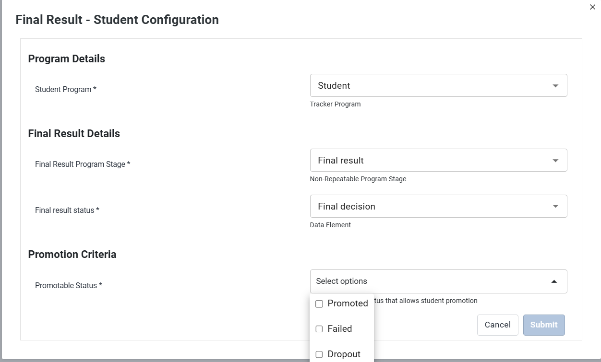

# Staff Configuration Overview

The **Staff Configuration** section in the SEMIS application allows administrators to control how staff-related modules operate within the system. Through this configuration interface, administrators can enable, disable, or adjust different staff management modules to align with institutional workflows.

This configuration ensures that only the required staff management features are available to users and helps standardize staff-related processes across schools.

## **Accessing Staff Configuration**

To access the Staff Configuration settings:

1. Open the **SEMIS application** in DHIS2.  
2. Navigate to **Configurations**.  
3. Look at different modules under Staff.

The configuration page displays several **module icons** that represent different staff-related processes available in the system.

The Staff Configuration section is designed to **map and control staff workflows within the SEMIS application**.

Administrators can use this interface to:

* Configure how staff records are managed.  
* Enable or disable staff-related modules.  
* Control the visibility of staff workflow features.  
* Customize the application based on administrative requirements.

This helps ensure that the system supports the staff lifecycle in a structured and controlled manner.

The Staff Configuration interface includes multiple modules that manage different aspects of staff administration.

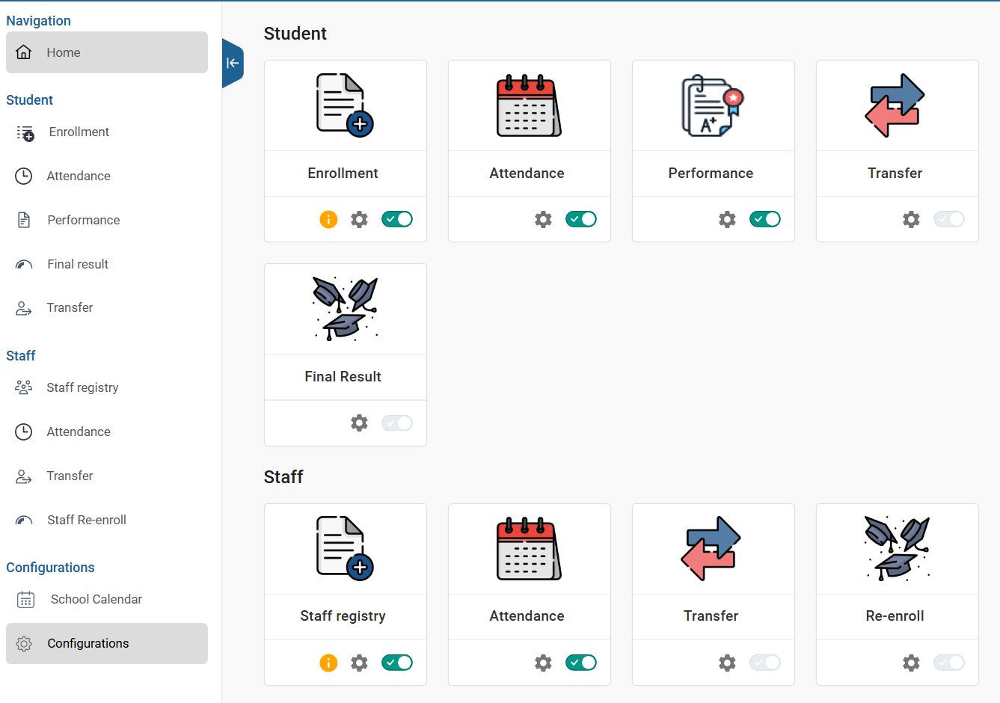

### **Staff Registry**

The **Staff Registry** module allows administrators or authorized users to **register and maintain staff records** in the system.  
 This includes basic staff information such as identity details, employment information, and institutional assignments.

1. Select and confirm DHIS2 tracker configured STAFF program.   
2. Specify Registration Details e.g Type of staff, Type of staff filter name, Registration program stage (DHIS2 tracker configured) etc. and Socio Economic details.  
3. Specify default configurations and submit.   
4. Fill in all mandatory fields, marked with \*

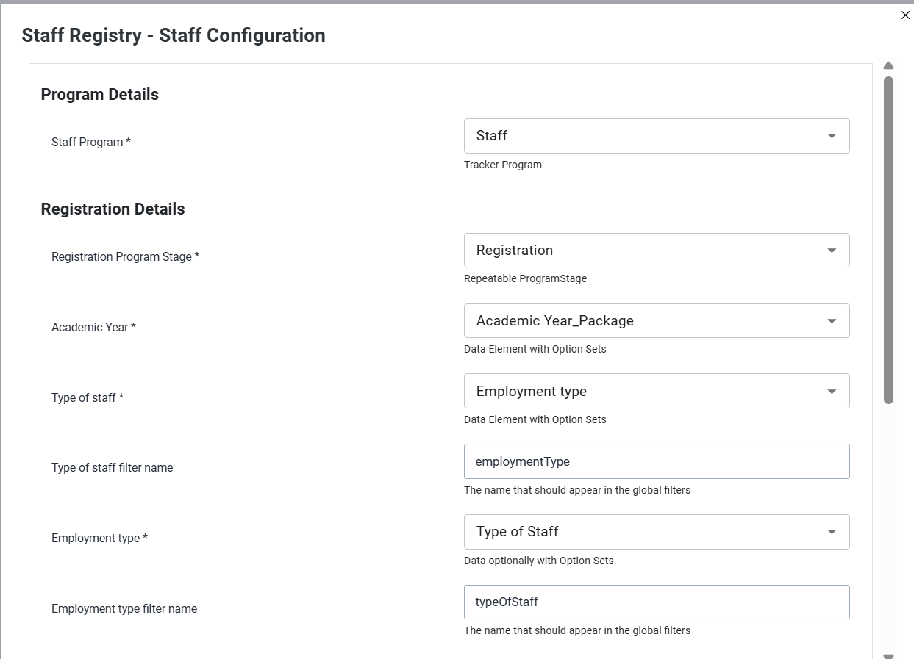

### **Attendance**

The **Attendance module** enables schools to **record and monitor staff attendance**.  
 It allows institutions to track daily staff presence and maintain attendance records for administrative purposes.

1. Select and confirm DHIS2 tracker configured STAFF program.   
2. Configure attendance statuses details and general details e.g. program stage, attendance status (Present, Absent).   
3. Configure class attendance (Optional)

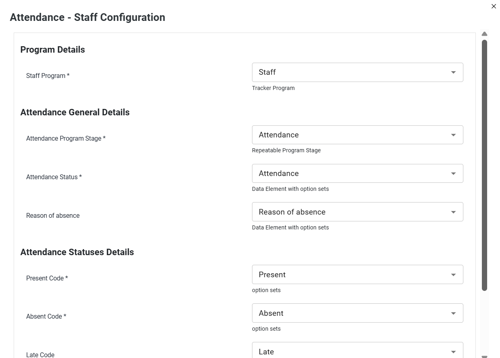

### **Transfer**

The **Transfer module** allows administrators to **manage staff movement between schools or institutions**.  
 This ensures that staff records remain updated when employees change their place of assignment.

1. Select and confirm DHIS2 tracker configured STAFF program.   
2. Confirm transfer request fields/status mapping   
3. Confirm incoming/outgoing list behavior tied to configured status.  
4. Confirm approval/rejection flow fields

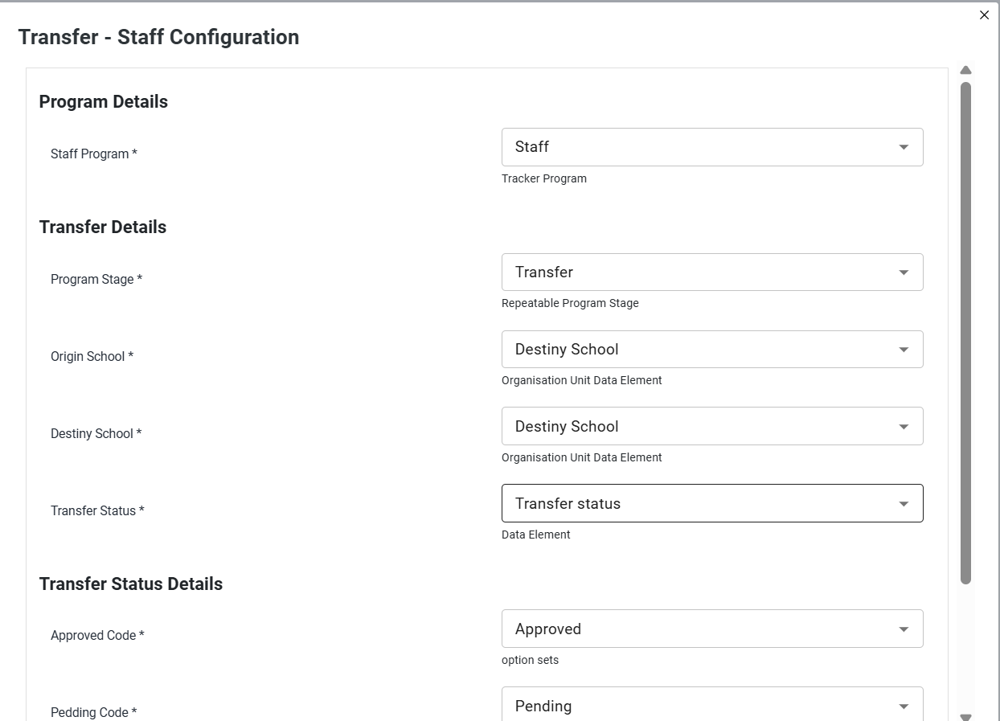

### **Re-enroll**

The **Re-enroll module** allows administrators to **re-activate or re-enroll staff records** when necessary.  
 This feature may be used when staff members return after a break in service or need to be reassigned within the system.

1. Select and confirm DHIS2 tracker configured STAFF program.  
2. Configure re-enrollable status values under Promotion & Dropout Criteria and Dropout Status.  
3. Configure Final Result details as final status and click submit.

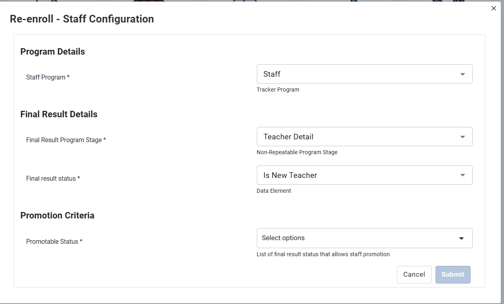

# Cross-Cutting Config Dependencies 

Several configuration components in SEMIS are interconnected. Changes or incomplete configuration in one area may affect the behavior of multiple modules across the system. Administrators should therefore ensure that foundational configurations are completed correctly before enabling related workflows.

Understanding these dependencies helps prevent system errors, incomplete data entry processes, and incorrect module behavior.

## **School Calendar Dependency** 

The **School Calendar configuration** must be properly defined before modules such as **Attendance** are used.

The calendar establishes:

* The **academic year**  
* **School terms**  
* **School operational days**  
* **Non-school days or holidays**

Attendance recording relies on this configuration to determine valid attendance dates. If the school calendar is not configured correctly:

* Attendance entry may not be available.  
* Attendance may appear disabled for certain dates.  
* Reports may show incorrect attendance calculations.

Administrators should therefore verify that the academic year, terms, and school days are configured before testing or enabling the attendance module.

## **Enrollment Mapping Dependency** 

The **Enrollment configuration** defines how students are registered and mapped within the system.

This configuration directly affects:

* **Student search functionality**  
* **Student listing in different modules**  
* **Student record updates**  
* **Workflow navigation across modules**

If enrollment mapping is incomplete or incorrectly configured, users may experience issues such as:

* Students not appearing in search results  
* Missing student records in attendance or performance modules  
* Errors when updating student information

Ensuring correct enrollment configuration guarantees that student records flow correctly across all student-related modules.

## **Final Result Configuration Dependency** 

The **Final Result configuration** determines how the system handles end-of-year academic outcomes for students.

This configuration affects the behavior of:

* **Promotion processes**  
* **Completion status**  
* **Final academic records**

Specifically, the configuration controls whether **Final Result action buttons** are enabled or disabled within the system interface.

If this configuration is missing or incorrect:

* The Final Result module may be unavailable.  
* Result submission buttons may remain disabled.  
* Students may not progress to the next academic level.

Administrators must ensure that final result statuses and related settings are properly configured before the end-of-year processing begins.

## **Transfer Configuration Dependency** 

The **Transfer configuration** manages how student or staff transfers are handled between schools or institutions.

This configuration defines:

* Transfer request workflows  
* Approval requirements  
* Movement of records between institutions

If the transfer configuration is incomplete or disabled:

* Transfer requests may not be generated.  
* Approval workflows may not function correctly.  
* Student or staff records may remain linked to the original institution.

Proper transfer configuration ensures that records move accurately within the SEMIS system when individuals change institutions.
