# User Guide - Learner Tracker - Student Education Management Information System (SEMIS) 

# Introduction and Overview

This guide is a support document to help users and trainers understand the **step-by-step process for SEMIS data capture**.

The manual explains the workflow of the **SEMIS App** and provides detailed walkthroughs with explanations and screenshots.

The SEMIS module is divided into two main sections:

Student Modules
- Enrollment  
- Attendance  
- Performance  
- Final Result  
- Transfer  

Staff Modules
- Staff Registry  
- Attendance  
- Transfer  
- Staff Re-enroll  

The **SEMIS (School Education Management Information System)** App in DHIS2 is designed to manage education data.

It helps collect and manage information such as:

- Student enrollment
- Attendance
- Academic performance
- Staff records
- School calendar information

Since individual-level education data involves **large routine data entry tasks** (such as marking attendance for entire classes), the SEMIS app simplifies these processes with structured data entry screens.

# Installation of the SEMIS App

If the SEMIS app is not already installed, it can be added by **uploading the app package into the DHIS2 instance**.

For this you can contact your administrator to provide you with GitHub details.

Note: The SEMIS app is currently not available for direct download from the DHIS2 App Hub.

You can explore the **SEMIS demo instance** for better understanding.

Kindly click on the link to go the demo site. [Link](https://emis.im.dhis2.org/demo)

**Note**

Users must have:
- A computer, tablet, or Android device
- Internet connection
- A supported browser  

Recommended browsers:
- Google Chrome  
- Mozilla Firefox  

# Logging In

To log in to **DHIS2 for Education**:

1. Launch **Google Chrome**.
2. Enter the DHIS2 web address.
3. Press **Enter**.
4. Wait for the page to load.
5. Enter the login credentials. (Details for login are provided in the log-in screen)

   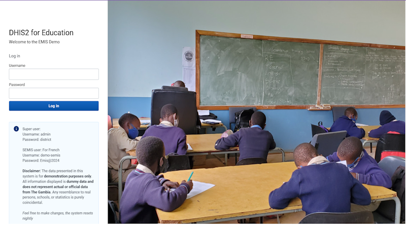

# Log Out

To log out:

1. Click the **user initials icon** at the top right corner.
2. Select **Log Out**.

   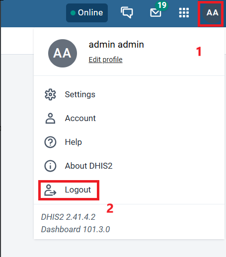

# DHIS2 SEMIS Navigation

1. After logging in, open the **App Menu** (top right corner).
2. Search for **SEMIS** using the search bar.
3. Click **SEMIS** to open the application.
   
   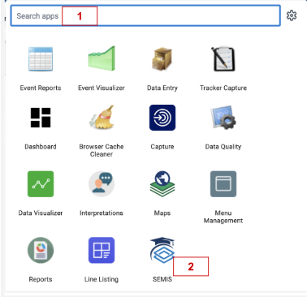

# Student Data Entry in SEMIS App

The **Student Learner Program** includes the following modules:.

1. Enrollment - Registers a learner **for the first time**.A learner should be enrolled **only once** during their schooling.
2. Attendance - Records **daily learner attendance**.Teachers can mark attendance for **multiple students simultaneously**.
3. Performance - Captures **assessment results** for each academic year.
4. Final Result (Promotion)- Promotes learners to the **next grade** at the end of the academic year.
5. Transfer - Manages movement of learners between schools.
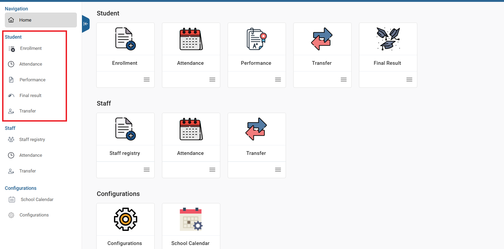

## Enrollment

This module allows new learners to be enrolled in the system.

    Note: Note: Always search for an existing student before creating a new record to avoid duplicate entries.Learners may be joining from different primary schools, but each learner should be registered only once throughout their entire education journey. Even when moving from primary to secondary school, learners must not be registered again as new students.

### Search for an Existing Student
Steps for Enrollment Data Entry

Select the following to view students from a specific class:
   - School
   - Grade
   - Section
   - Academic Year   

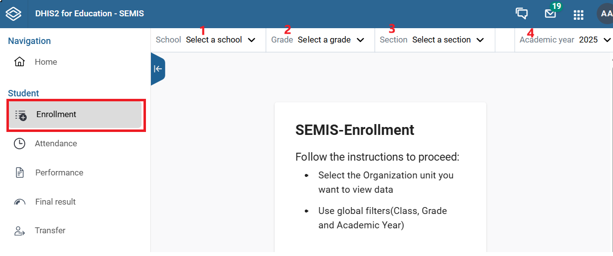

The system will display students in that class.

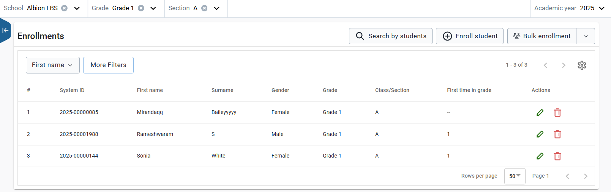

Alternatively:

1. Use the **Search Student tab**.
2. Enter search criteria.
3. View the student's **enrollment history**.

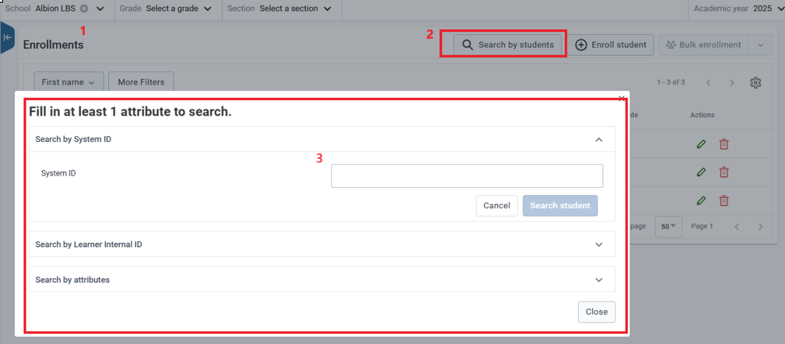

A list of learners who match the criteria by which the search was being done will be presented to you.

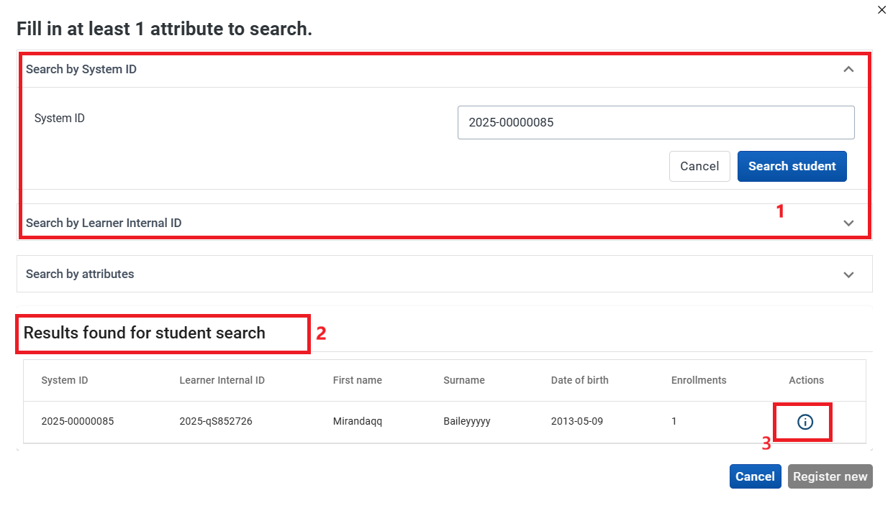

At the right end of each row of a learner, will be an action column with
Once that button is selected, you will be presented with the Enrollment history of the learner covering the schools they have previously been enrolled in the different academic years

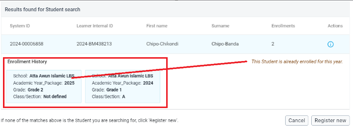

However, if the student is not yet enrolled in any school for that academic year, case in point the form, go ahead and click on **Register new** tab to enroll them under the school they have transitioned to.
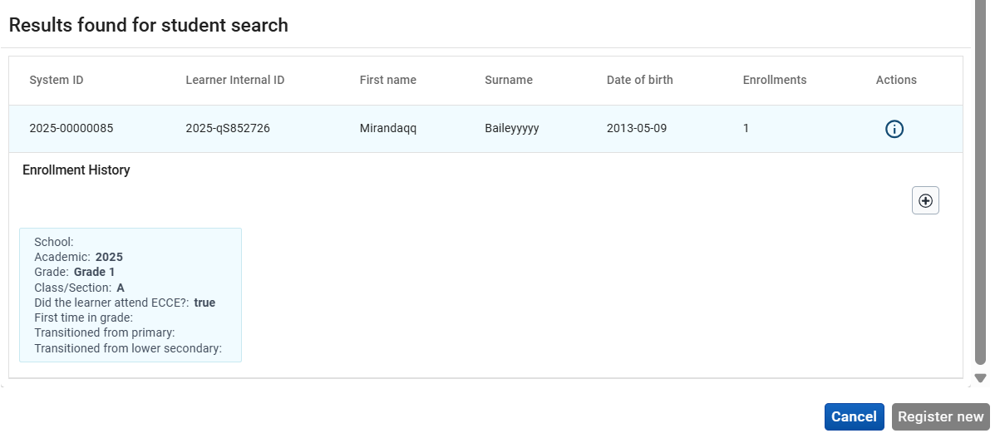

### Enroll a New Student

Register a new learner
There are two ways of registering a learner:
1. **Single Enrollment**: With this learner Enrollment is done one learner at a time
2. **Bulk Enrollment**: With this, multiple learners can be imported into the system using an excel file.

#### Single Student Enrollment

Steps:

1. To register a single learner, click on the button. You will be presented with a dialogue box where learner details can be entered. These learner details include: Enrollment details such as Academic year, Grade, Class, Student profile such as Name, Date of birth and annual profile details and submit the details.
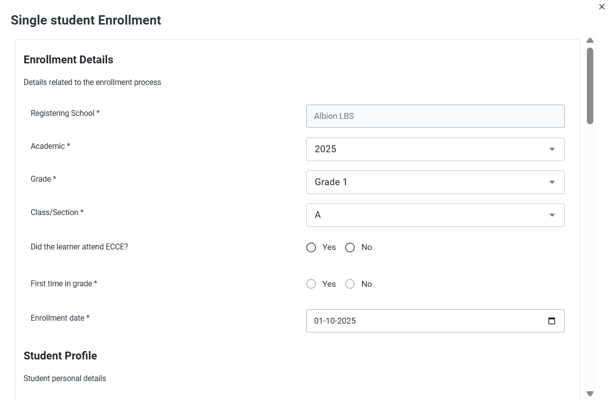
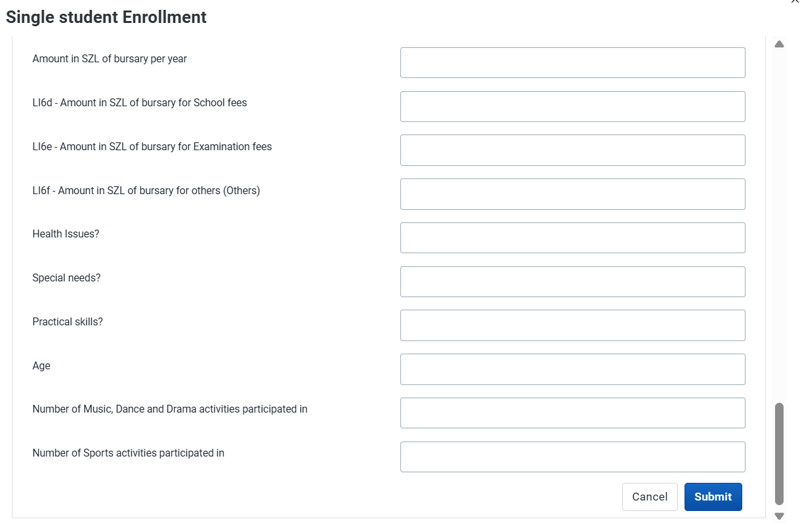

#### Bulk Enrollment

This option is used to enroll multiple learners at once.

You get two options
1. To enroll new students
2. To update the existing students

Steps:

1. Click **Download Template**.
2. Enter number of students.
3. Fill the Excel template.
4. Upload the completed template.
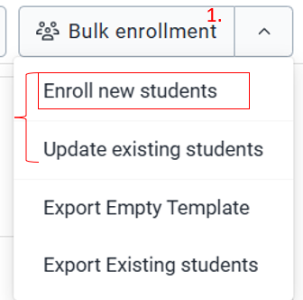
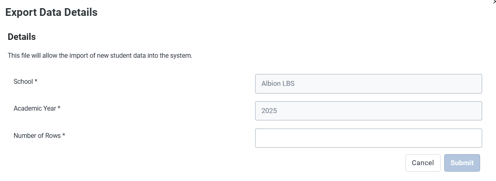
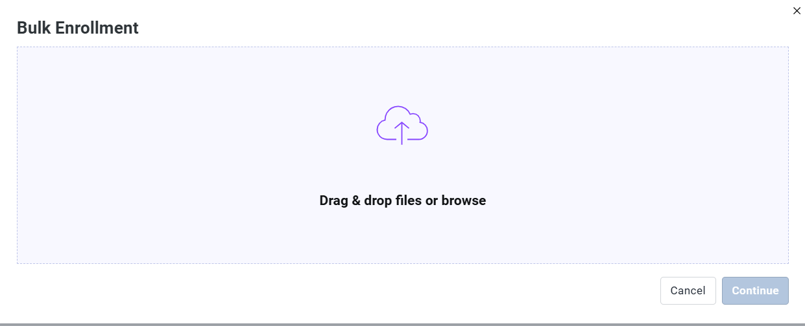
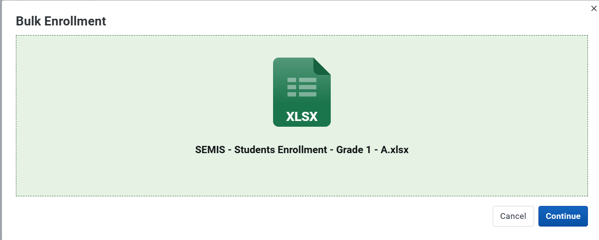
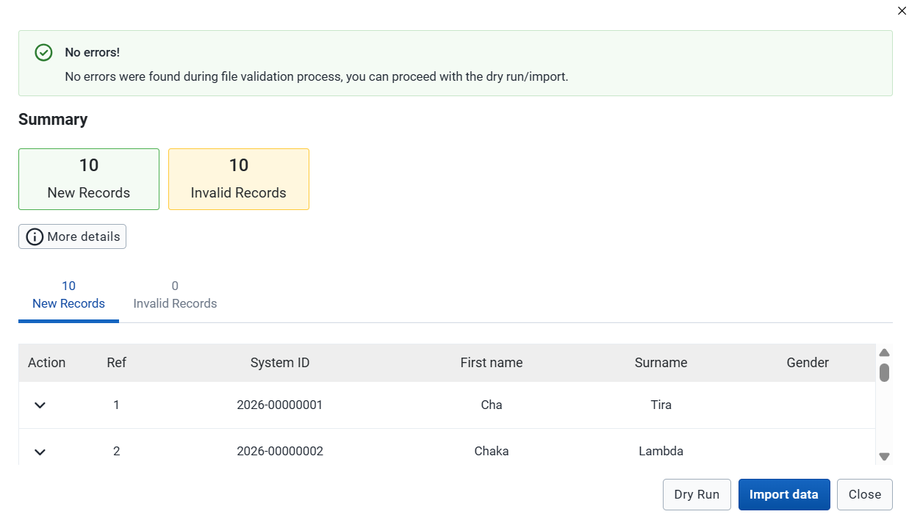
5. Review errors.
   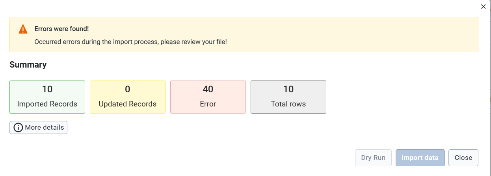
6. Click **Import Students**.
   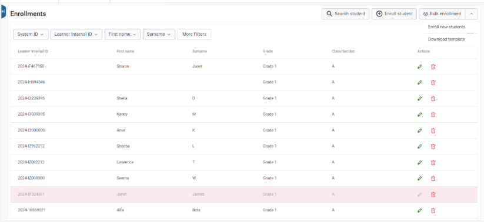

## Attendance Module

This module records **student attendance**.

Steps:

1. Select:
   - School
   - Grade
   - Class
   - Academic Year

2. Click **Take Attendance**.

Options available:

- **Mark All as Present**
- **Present**
- **Absent**
- **Late**

If a learner is **absent**, provide a **reason for absence**.

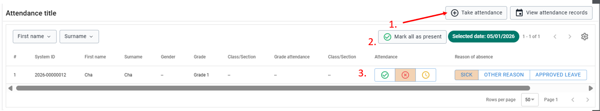

### Viewing Attendance Records

1. Click **View Attendance Records**.
2. A **calendar view** will appear.
3. Select an **end date**.
4. Review attendance status.
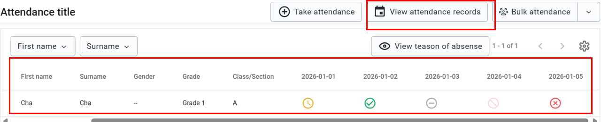

### Bulk Attendance

Steps:

1. Click **Bulk Attendance**.
2. Select **Import Student Attendance**.
3. Upload the attendance file.
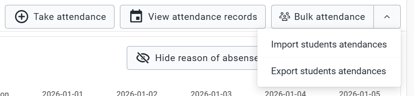

## Performance Module

The performance module is majorly used to capture learner scores/ results over the different terms within the academic year. As is done with the other modules, start by filtering by school, grade and class. You will be presented with a list of learners and buttons for the different terms.

Steps:

1. Filter by:
   - Academic Year
   - School
   - Grade
   - Class

2. Select the term:
   - Term 1
   - Term 2
   - Term 3

3. Click **Allow Edit Mode**.

4. Enter scores in the subject cells.
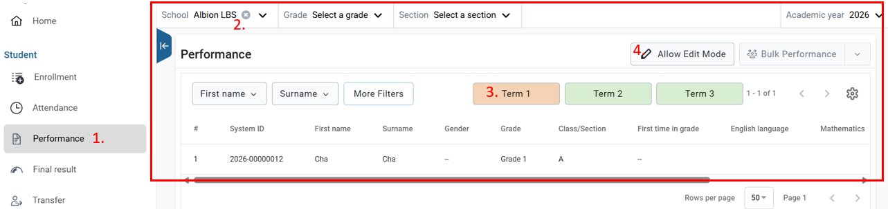
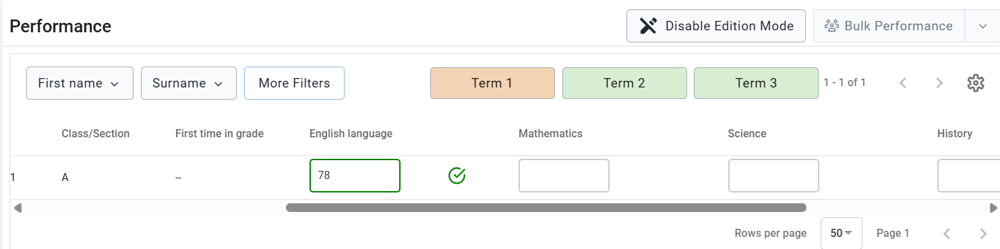

A **green border** indicates the score has been saved.

## Final Result and Promotion Module

The final result module is majorly used to promote / progress learners from one grade to the next. Just like the rest of the modules, start by filtering by school, grade and class. You will be presented with a list of learners, each with a checkbox on the left-hand side. 

Steps:

1. Filter by school, grade, and class.
2. Select learners using checkboxes.
3. Mark status:
   - Promoted
   - Failed
   - Dropped out

4. Click **Submit**.

5. Click **Perform Promotion**.

Update:
- Academic year
- Grade
- Class
- Enrollment date

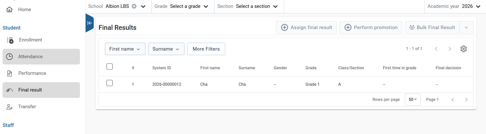
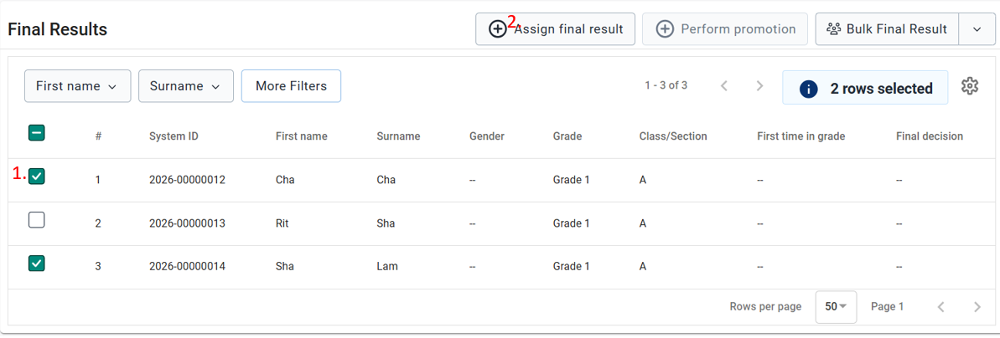
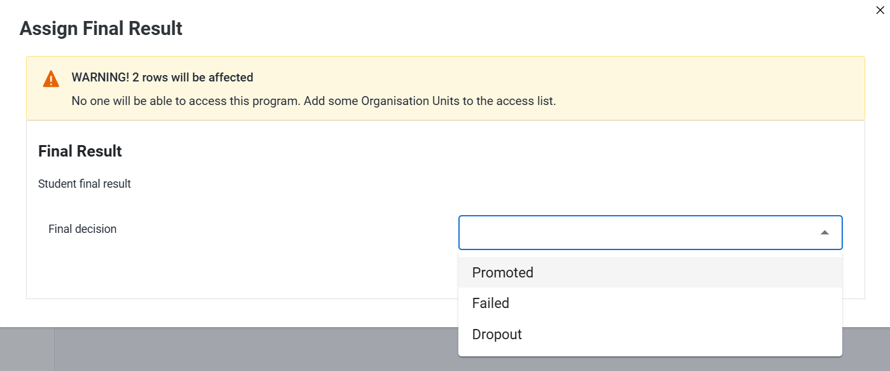
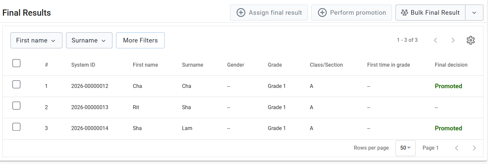

## Transfer Module

This module allows for transfer / moving of learners from one school to another; while maintaining record of the history of schools the learner has previously been enrolled in.

Two transfer tabs are available:

- **Outgoing Transfer**
- **Incoming Transfer**
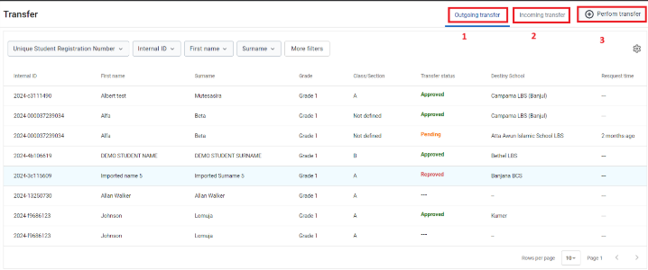

### Outgoing Transfer

Steps:

1. Click **Perform Transfer**.
2. Select learners.
3. Click **Execute Transfer**.
4. Choose destination school.
5. Select transfer reason.
6. Click **Perform Transfer**.

A confirmation message will appear.

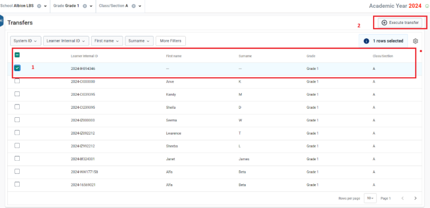
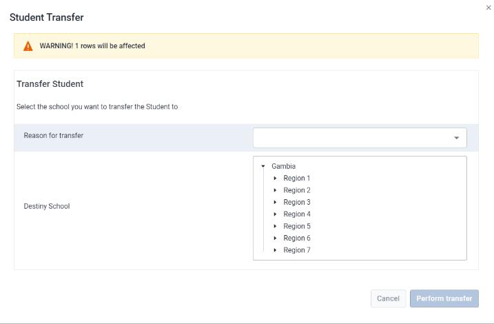
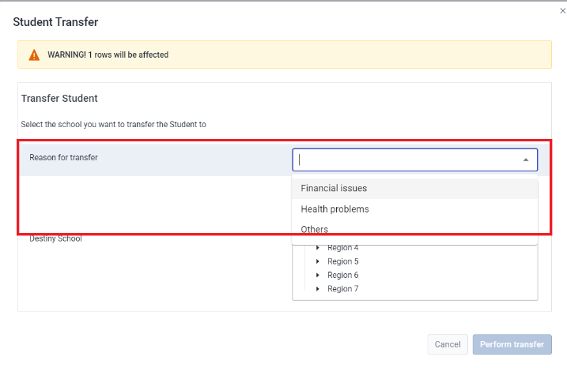
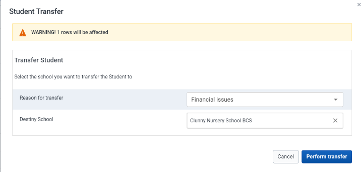

### Incoming Transfer

Receiving schools can:

- **Approve transfer**
- **Reject transfer**

Approved learners will appear in the new school’s student list.

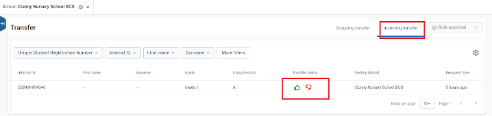
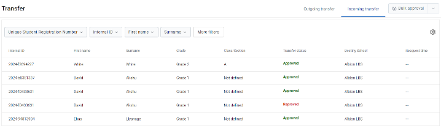

## Staff Data Entry in SEMIS App

This module allows for transfer / moving of learners from one school to another; while maintaining record of the history of schools the learner has previously been enrolled in.
Staff Program focuses on 3 major components:
1. **Staff registration**: This allows for registration of staff into the system. Each staff should be registered only once all through their lifetime in the education system
2. **Staff Attendance**: This allows for attendance of staff.
3. **Staff transfer**: This allows transfer of staff from one school to another given that overtime staff may be transferred or change their employment to a different school.
4. **Re-enroll**: The Staff Re-Enrolment module provides functionality to update and confirm staff details at the beginning of every academic year. This feature allows administrators to efficiently revalidate employment information for all staff members and ensure that only active and correctly assigned personnel are carried forward into the new academic cycle. 
With this capability, administrators can seamlessly process re-enrolment for multiple staff members at once, review their employment status, and make necessary updates such as role changes, deployment adjustments, contract renewals, or status modifications. The module streamlines the annual re-enrolment workflow within DHIS2, ensuring that each staff member’s record is accurate and up to date for the new school year

The staff module manages:

- Staff registration
- Staff attendance
- Staff transfers
- Staff re-enrollment

### Staff Registry

This module allows for new staff, both teaching and non-teaching, to be enrolled into the system. Ensure that each staff is enrolled only once in their lifetime in the education system. 

1. Select the school to register staff in. (Users who are attached to only one school will see only one school in this list)
2. Select the correct academic year. You will now be presented with the list of staff.
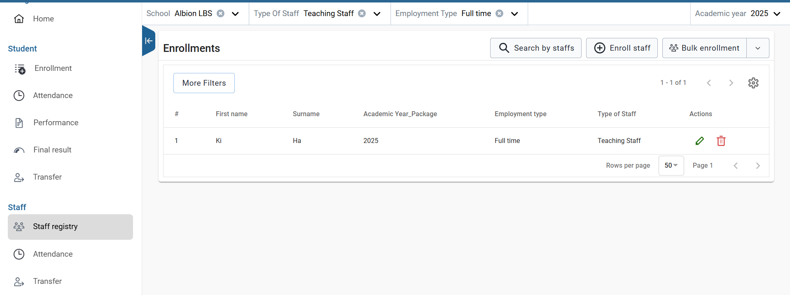

#### Registers new staff members.

Each staff member should be **registered only once**.

Registration methods:

- Single registration - With this staff registration is done one at a time

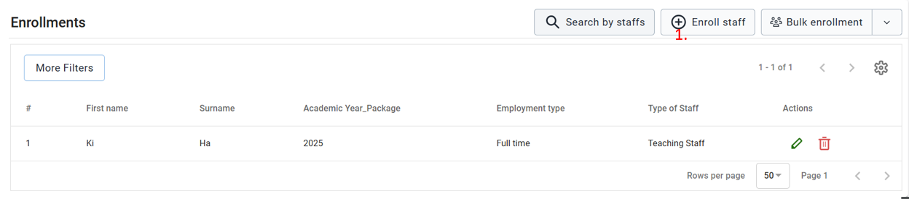
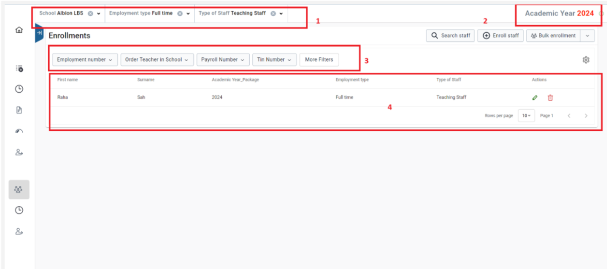
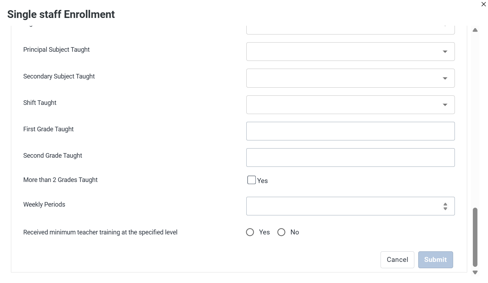
- Bulk registration - With this, multiple staff can be imported into the system using an excel file.

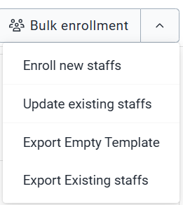
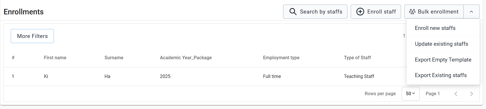
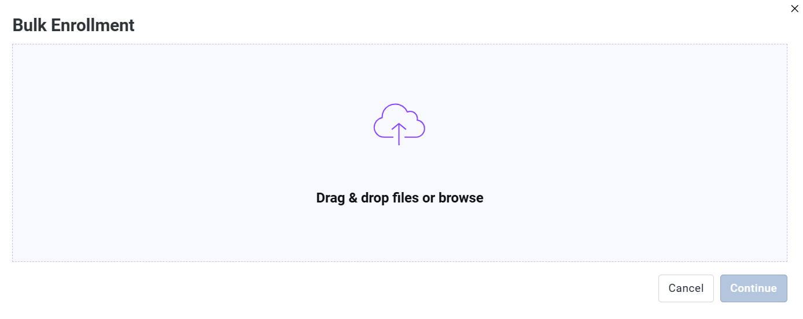

### Staff Attendance

The staff attendance module allows administrators to:
1. Record daily attendance for teachers and other staff
2. Monitor staff presence and absences
3. Track attendance patterns for administrative and compliance needs

Records daily attendance for staff.

Steps:

1. Select:
   - School
   - Staff type
   - Employment type
   - Academic year

2. Click **Take Attendance**.

Options:

- Present
- Absent
- Late
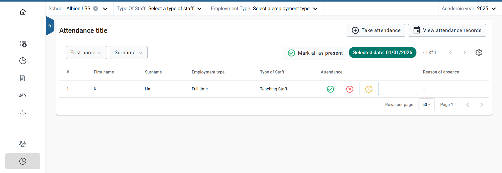
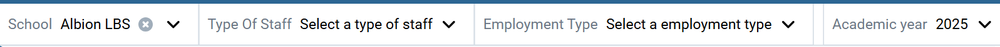
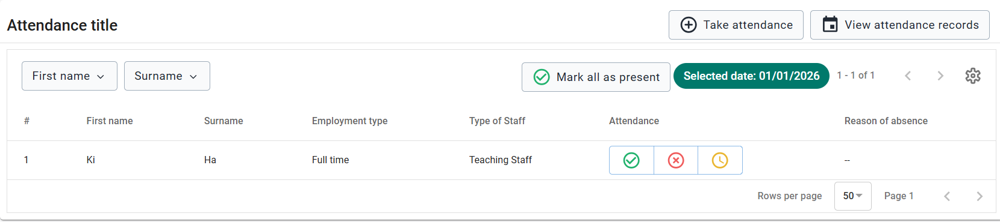
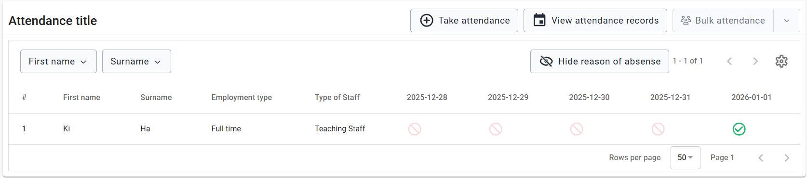

### Staff Transfer

This module allows for transfer / moving of staff from one school to another, while maintaining record of the history of school staff has previously been employed in.
The first step is to select the school from which a staff member is being transferred (origin school). When this is done, you will be presented with a screen that has two tabs:

1. **Outgoing transfer**: This tab presents a list of staff that have been transferred from the selected school and the status of their transfer
2. **Incoming transfer**: This tab presents a list of staff that are being transferred into the selected school and allows the school to either approve or reject the transfer.

#### Outgoing Staff Transfer

Steps:

1. Click **Perform Transfer**.
2. Select staff members.
3. Click **Execute Transfer**.
4. Choose destination school.
5. Select transfer reason.
6. Click **Perform Transfer**.

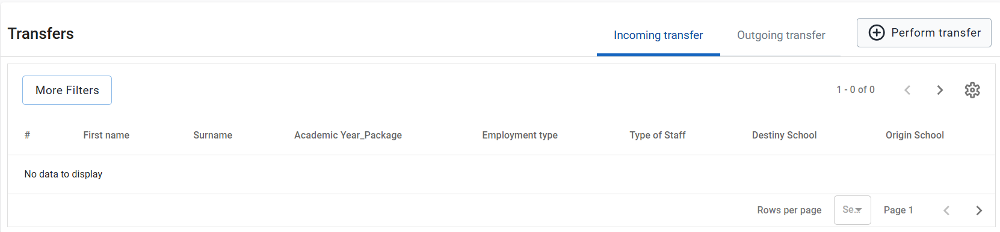

#### Incoming Staff Transfer

Receiving schools can:

- Approve transfer
- Reject transfer

Once approved, staff will appear in the new school's staff list.

### Staff Re-Enroll

The Staff Re-Enrolment module provides functionality to update and confirm staff details at the beginning of every academic year.

Steps:

1. Select filters:
   - School
   - Staff type
   - Employment type
   - Academic year

2. Select staff using checkboxes.

3. Click **Assign Re-Enrollment Status**.

4. Click **Perform Re-Enrollment**.

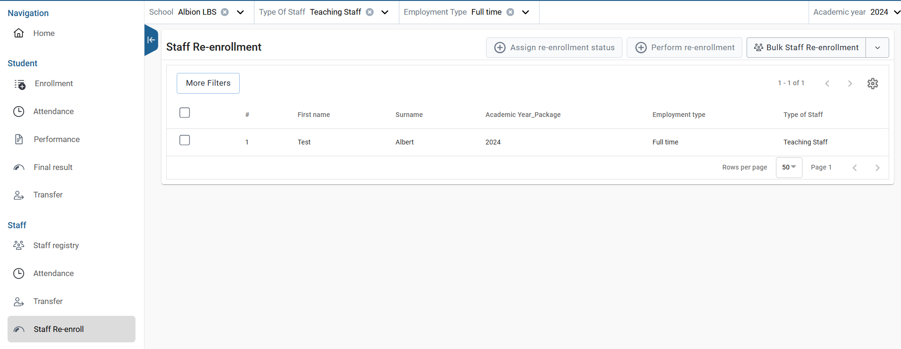
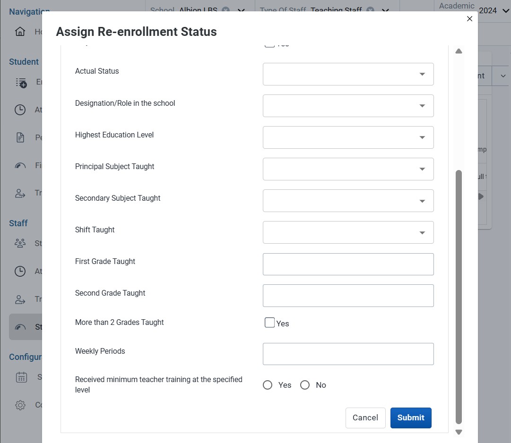

# Configuration Module

Unlike systems that use a separate configuration application, SEMIS integrates configuration directly within the SEMIS App interface. Administrators can access configuration features by selecting the Configuration option within the SEMIS application.
This integrated design ensures that system administrators can configure the system while remaining within the same application environment used for operational workflows.

You can get more details on this topic under **SEMIS Configuartion Manual**.

